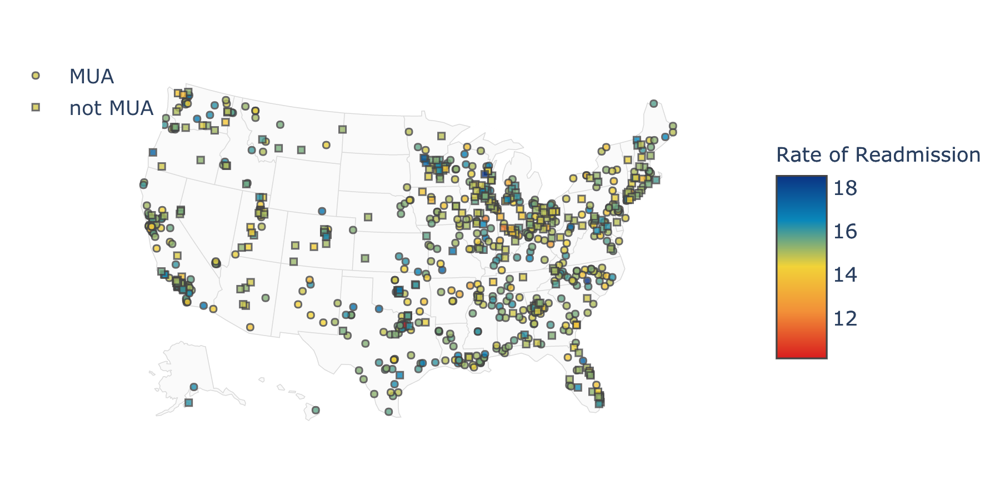

# Exploring Patient Satisfaction and Readmission in Medically Underserved Areas

*python | API queries | data mining | data cleaning | data visualization*

# Intro

Working in a hospital has given me an appreciation of the complexity of helthcare outcome measures and the diversity of interested parties. This project aims to explore outcome measures and indices of medical underservice, in order to reveal potential areas for investment. 

## Readmission rate and patient satisfaction 

Unplanned readmissions are very costly and often preventable. The metric of readmission rate is thus used by entities, such as Center for Medicaid Services (CMS), to evaluate a facility. 

Additionally, healthcare is a *service* that can also be evaluated by *patient reported outcome measures* (PRAMs) such as the Consumer Assessment of Healthcare Providers and Systems (CAHPS). 

## Improving outcome measures in medically underserved areas

Tasks such as follow-up calls and medication reconciliation demand resources. Therefore, facilities in medically underserved areas (MUAs)may struggle to achieve high levels of patient satisfaction and decrease readmission rates.

CMS uses a number of measures, such as physicians per 1000 population,and infant mortality rates, to identify MUAs. 

# Project goals

In this project, I aimed to explore the relationships between readmission rates and CAHPS outcomes in MUAs and non-MUAs. I hoped to answer these questions:

- Does readmission rate and patient satisfaction have a positive correlation, or must we make tradeoffs in improvements?
- Are measures used to determine MUA status related to a facility's outcome measures? 
- Should investments aimed at improving outcome measure target MUA measures? 

# Data from Center for Medicare/Medicaid Services' [API](https://dev.socrata.com) 
I queried this API to combile data 
 on 
 - [Readmissions by hospital](https://data.medicare.gov/Hospital-Compare/Unplanned-Hospital-Visits-Hospital/632h-zaca
)
- [Patient satisfaction outcomes (CAHPS) by hospital](https://data.medicare.gov/Hospital-Compare/Outpatient-and-Ambulatory-Surgery-Consumer-Assessm/yizn-abxn
)
- [Medically Underserved Areas + measures](https://bhw.hrsa.gov/shortage-designation)

Optional for connecting to SODA API: 
- Create a SODA key [info here](https://dev.socrata.com/docs/app-tokens.html)
- Create a `private.py` in the root directory of the project
- set the values API_TOKEN and API_SECRET in that file

# Setup

- My anaconda venv can be created by running  `conda env create -f environment.yml` in the terminal
- Or, pip install packages with `pip install -r requirements.txt`

# Usage

Clone this repo to view project scripts and Jupyter nb in the `healthcare_quality` directory

- Project scripts 
    - `clean_data.py` imports each datasets (from `import_data.py`), cleans them, and combines them. 
        - the `cleaning` module contains a few custom scripts that are imported by `clean_data.py`
    - `corr.py` runs some correlations between variables
    - `plots/cahps_resp_dist.py` plots the distributions the patient experience responses 
    - `plots/pairplot.py` plots patient experience measures and one of the MUA measures
    - `plots/mua_scatter.py` plots readmission rate and patient experience measures

- `healthcare_quality.ipynb` contains all the code for the project, as well as plotly version of the plots
    -  Make sure to "trust" the notebook or the plotly plots may not show

# Findings

- My exploration showed that while minor, there is a negative association between measures of patient satisfaction and readmission rates (as I expected). This suggests that hospital administrators shouldn't necessarily be concerned that measures to decrease readmission rates would decrease patient satisfaction.
- Additionally, the relationship between MUA status and measures is minimal. It appears that the underlying causes of these factors may be different. An important note is that these measures only cover a subset of the ways in which patients are medically underserved. Some areas with higher IMU scores may be underserving certain specific populations (such as those with low-income, or non-English speakers).
